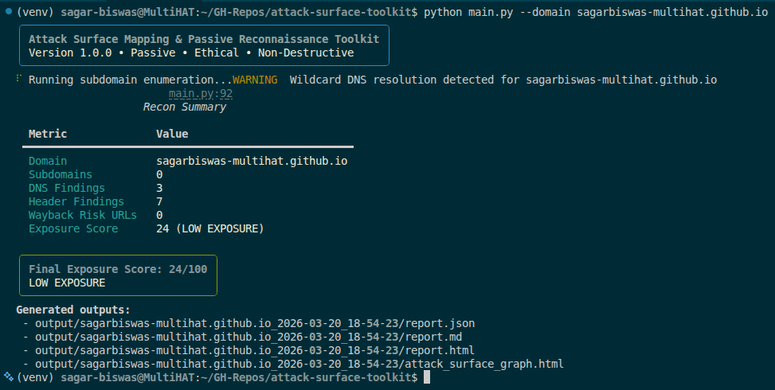
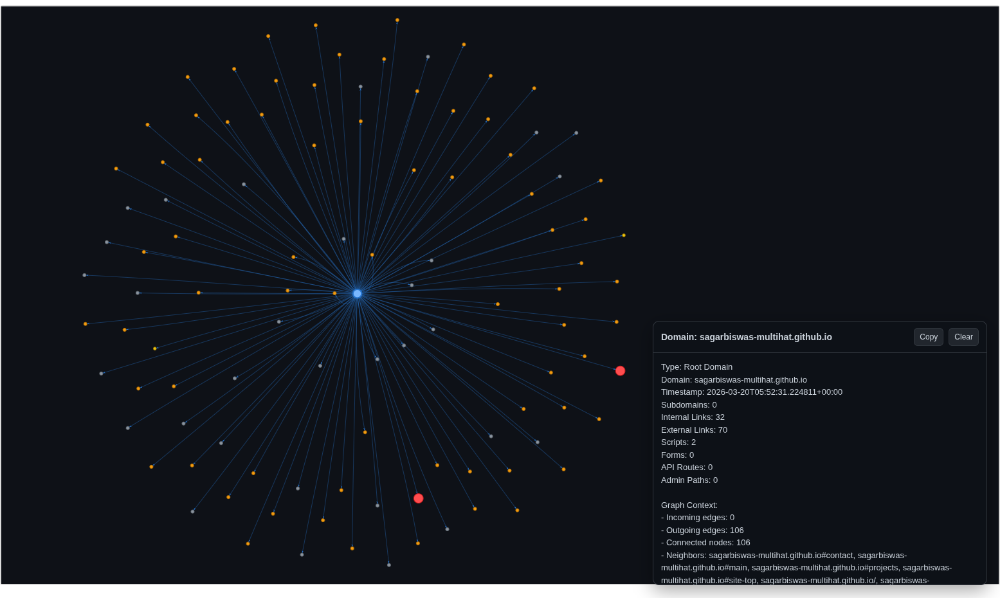
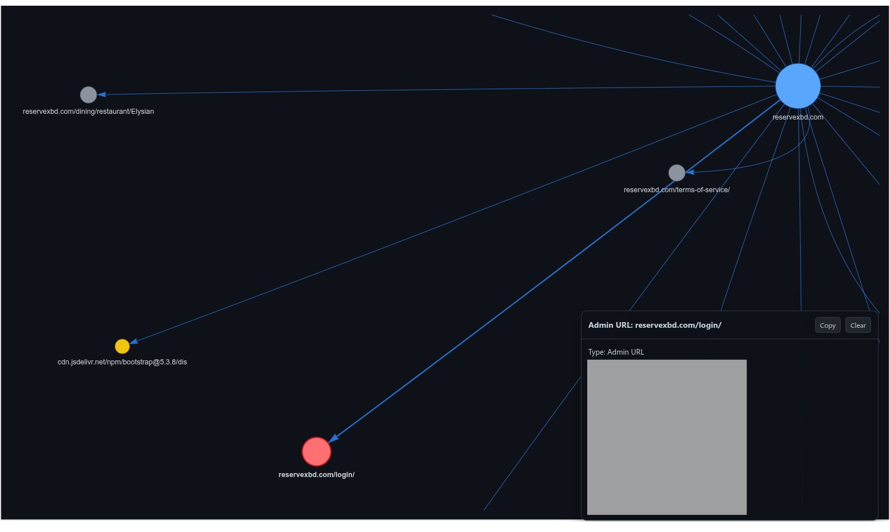
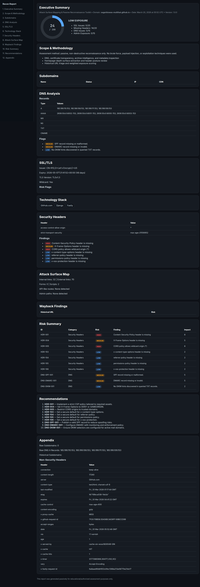
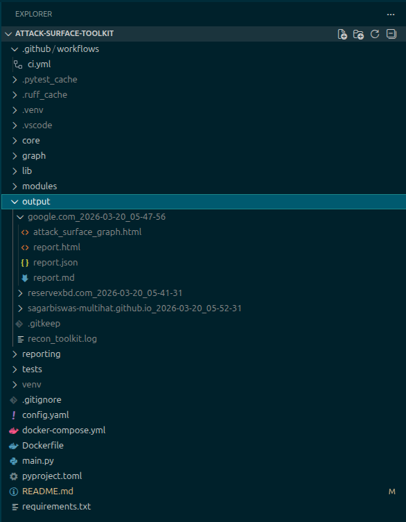

# attack-surface-toolkit

<div align="right">

 
&nbsp;
 
&nbsp;

&nbsp;

&nbsp;

</div>

A passive attack surface mapping and reconnaissance toolkit for authorized web security assessments.

---

### Pictures

<details>

<summary>Click to expand</summary>

<div align="center">











</div>

--- 

</details>

### Live Outputs: 

- [google.com | attack_surface_graph.html](https://sagarbiswas-multihat.github.io/attack-surface-toolkit/output/google.com_2026-03-20_05-47-56/attack_surface_graph.html)

- [google.com | report.html](https://sagarbiswas-multihat.github.io/attack-surface-toolkit/output/google.com_2026-03-20_05-47-56/report.html)

---

- [reservebd.com | attack_surface_graph.html](https://sagarbiswas-multihat.github.io/attack-surface-toolkit/output/reservexbd.com_2026-03-20_05-41-31/attack_surface_graph.html)
- [reservebd.com | report.html](https://sagarbiswas-multihat.github.io/attack-surface-toolkit/output/reservexbd.com_2026-03-20_05-41-31/report.html)

---

- [sagarbiswas-multihat.github.io | attack_surface_graph.html](https://sagarbiswas-multihat.github.io/attack-surface-toolkit/output/sagarbiswas-multihat.github.io_2026-03-20_05-52-31/attack_surface_graph.html)
- [sagarbiswas-multihat.github.io | report.html](https://sagarbiswas-multihat.github.io/attack-surface-toolkit/output/sagarbiswas-multihat.github.io_2026-03-20_05-52-31/report.html)

---

## What This Is

This project maps a web target’s external exposure using passive OSINT and non-destructive metadata collection. It was built to produce the kind of output a security consultant can hand to a client directly: clear evidence, practical findings, and prioritized remediation guidance.

The workflow focuses on discovering what is already visible from public infrastructure and historical archives. It does not perform exploitation, brute force, payload injection, or aggressive scanning. The intent is to give teams a reliable baseline of their external attack surface before any invasive testing starts.

It is also designed as a Fiverr portfolio deliverable: not just technically functional, but presentation-ready. Reports are structured to look like real consulting artifacts, with executive summary views for non-technical stakeholders and detailed appendices for engineers.

## Features

The toolkit runs module-based reconnaissance and consolidates results into one scored assessment.

- Subdomain enumeration from crt.sh, AlienVault OTX, HackerTarget, RapidDNS, and archive intelligence.
- DNS analysis for A, AAAA, MX, NS, TXT, CNAME, SOA, PTR plus SPF/DMARC/DKIM posture checks.
- WHOIS and ASN enrichment for registrar, domain lifecycle, IP ownership, and hosting context.
- SSL/TLS inspection for certificate validity, issuer, SAN exposure, protocol posture, and trust indicators.
- Technology detection from response headers, HTML indicators, cookies, scripts, and favicon fingerprints.
- Security header audit for CSP, HSTS, X-Frame-Options, X-Content-Type-Options, Referrer-Policy, and related controls.
- Attack surface mapping for links, forms, JavaScript assets, API-like routes, and common admin paths.
- Wayback Machine historical URL analysis for legacy endpoints and exposed artifact patterns.
- Weighted exposure scoring engine with a 0–100 score and severity label.
- Four output deliverables: HTML report, JSON report, Markdown report, and interactive attack surface graph.

## Report Outputs

Each run creates a timestamped folder under output with four deliverables.

- report.html → Dark-themed client report with fixed sidebar navigation, animated score gauge, sortable tables, and print-friendly CSS.
- report.json → Full machine-readable dataset for automation pipelines, API ingestion, or SOC workflows.
- report.md → Clean narrative summary with structured findings and emoji risk badges for quick sharing.
- attack_surface_graph.html → Interactive graph of domain relationships and discovered assets, color-coded by node type and risk context.

## Architecture

```text
attack-surface-toolkit/
├── core/          → config, logging, rate limiting, models
├── modules/       → all recon modules
├── reporting/     → HTML, JSON, Markdown generators
├── graph/         → attack surface graph
├── tests/         → pytest test suite
└── output/        → generated reports (per domain + timestamp)
```

`core` defines runtime contracts and reliability controls, `modules` collect evidence, `reporting` translates findings for different audiences, and `graph` provides interactive topology context.

## Installation

### Method A — Standard (venv)

```bash
git clone https://github.com/SagarBiswas-MultiHAT/attack-surface-toolkit.git
cd attack-surface-toolkit
python -m venv venv
source venv/bin/activate   # Windows: venv\Scripts\activate
pip install -r requirements.txt
```

### Method B — Docker

```bash
docker build -t attack-surface-toolkit .
docker run -v $(pwd)/output:/app/output attack-surface-toolkit \
    --domain example.com
```

### Method C — Docker Compose

Edit the domain in docker-compose.yml, then run:

```bash
docker-compose up
```

## Usage

```bash
# Basic scan — all modules, all outputs
python main.py --domain example.com
```
Use this for full baseline reconnaissance and complete deliverables.

```bash
# Specific modules only
python main.py --domain example.com --modules dns,ssl,headers
```
Use this when you need a focused validation pass on selected controls.

```bash
# Skip Wayback (faster scans)
python main.py --domain example.com --skip-wayback
```
Use this for quicker runs when historical exposure is out of scope.

```bash
# No attack graph
python main.py --domain example.com --no-graph
```
Use this in constrained environments where interactive graph output is not needed.

```bash
# Select output formats
python main.py --domain example.com --output html,json
```
Use this when you only need client-facing HTML and machine-readable JSON.

```bash
# Custom config file
python main.py --domain example.com --config custom_config.yaml
```
Use this for team-specific settings, keys, and module toggles.

## Configuration

Below is a complete config.yaml walkthrough with inline comments.

```yaml
general:
    output_dir: ./output              # Base directory for timestamped run folders
    log_level: INFO                   # Logging verbosity: DEBUG, INFO, WARNING, ERROR
    request_timeout: 10               # Default request timeout (seconds) for modules
    max_concurrent_requests: 5        # Global async concurrency cap for outbound requests

api_keys:
    securitytrails: ""               # Optional API key for enhanced subdomain enrichment
    shodan: ""                       # Reserved optional key for future integrations
    virustotal: ""                   # Reserved optional key for future integrations

modules:
    subdomain_enum: true              # Passive subdomain discovery from OSINT sources
    dns_analysis: true                # DNS records + misconfiguration checks
    whois_asn: true                   # WHOIS + ASN + hosting context enrichment
    ssl_tls: true                     # Certificate and TLS posture inspection
    tech_detection: true              # Technology fingerprinting from headers/HTML/cookies
    header_audit: true                # Security headers validation and findings
    surface_mapper: true              # Depth-1 route/link/form/script extraction
    wayback: true                     # Historical URL intelligence via archive CDX
    attack_graph: true                # Interactive graph generation output

rate_limits:
    crtsh_delay: 1.0                  # Delay between crt.sh requests (seconds)
    wayback_delay: 0.5                # Delay before Wayback calls (seconds)
    dns_concurrent: 10                # DNS query concurrency limit
```

## Sample Report Findings

| ID | Category | Risk | Finding | Recommendation |
|---|---|---|---|---|
| HDR-001 | Security Headers | HIGH | Content-Security-Policy header is missing | Define a strict CSP and phase in with report-only first. |
| SSL-EXP-001 | SSL/TLS | MEDIUM | Certificate expires in 21 days | Automate renewal and add certificate expiry alerting. |
| DNS-DMARC-001 | DNS | MEDIUM | DMARC record missing or invalid | Publish a DMARC policy and monitor aggregate reports. |
| WB-001 | Wayback | HIGH | Historical URL indicates exposed backup artifact | Validate removal, rotate secrets, and block public access patterns. |

## Running Tests

```bash
python -m pytest tests/ -v
```

The test suite covers config validation, DNS analysis behavior with mocks, subdomain normalization/deduplication, exposure score calculations, SSL certificate parsing, and JSON report schema expectations.

## Ethical Use Statement

Use this toolkit only on domains and infrastructure you own, or where you have explicit written authorization to assess. It is intentionally designed for passive reconnaissance and non-destructive assessment workflows, not exploitation. The authors accept no liability for misuse.

## License

MIT License.

## Author / Portfolio Note

Built as a portfolio project demonstrating passive OSINT, attack surface mapping, and security reporting skills. Available as a Fiverr service for authorized security assessments.
